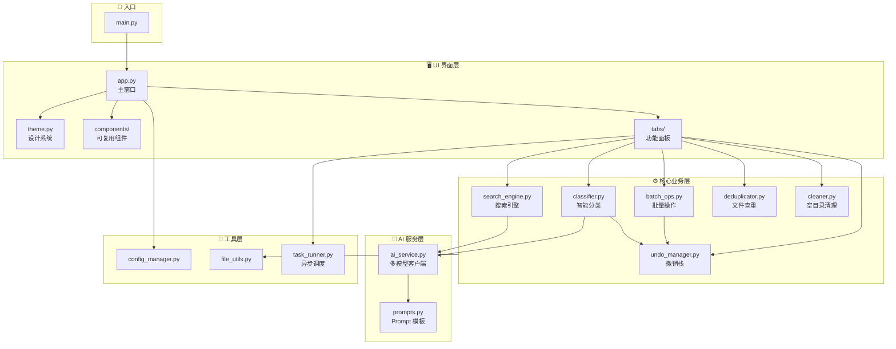

<div align="center">

# 📁 Smart Folder Manager Pro

**智能文件夹管理大师 Pro**

AI-Powered Intelligent Desktop File Manager with Batch Operations, Undo Transactions & Modern UI

一款面向学习与实践的现代化桌面文件智能管理工具，结合批量文件操作、可撤销事务和多大模型能力。

[](https://www.python.org/)
[](LICENSE)
[](https://github.com/jack1234567303/smart-folder-manager)
[](https://github.com/TomSchimansky/CustomTkinter)
[](https://github.com/jack1234567303/smart-folder-manager)

</div>

---

<!-- 截图占位区域 —— 如果你有程序截图，放入 screenshots/ 目录并取消下方注释即可 -->
<!-- <div align="center">
  
  <p><em>Modern Slate — 深色模式</em></p>
</div> -->

## 🌟 核心亮点

<details open>
<summary><strong>1. 现代化专业工作站界面 — Studio Pro / CustomTkinter</strong></summary>

- 采用 **Modern Slate** 设计系统与深/浅自适应调色体系，告别传统 Tkinter 的粗糙质感与刺眼色散
- 内置高性能虚拟懒加载目录树（`<<TreeviewOpen>>` 按需加载）并支持一键折叠/展开，解决大型目录树占用展示空间的问题
- 顶部一体化现代地址栏 (Omnibar) 与纯粹单色数据表 (ResultTable)，内嵌交互式结果看板并支持在系统资源管理器直接定位文件
- 底部智能可折叠终端面板 (ProgressPanel)，平时以极简胶囊条显示进度，点击可向上展开等宽代码终端日志框

</details>

<details open>
<summary><strong>2. 全异步防假死调度 — Async Worker & Task Runner</strong></summary>

- 采用后台工作线程池 + 线程安全主事件循环桥接机制，所有文件 I/O、哈希计算及 AI 网络请求均在子线程运行
- 支持实时进度条、毫秒级执行日志输出以及**随时可中断/取消任务 (CancellationToken)**

</details>

<details open>
<summary><strong>3. 双重安全机制与事务级撤销 — Undo Manager & Safe Recycle</strong></summary>

- **操作撤销栈 (Undo Stack)**：每次批量分类与批量重命名生成事务日志（Transaction），支持在历史记录面板一键逆向恢复文件
- **防误删保护**：文件删除全面接入系统回收站（`send2trash`），杜绝直接物理粉碎造成的数据丢失风险
- **智能防覆盖**：目标文件夹存在同名文件时自动重命名（如 `file (1).txt`），保障数据安全

</details>

<details open>
<summary><strong>4. 通用大模型赋能 — OpenAI-Compatible AI Layer</strong></summary>

- 采用标准 OpenAI API 协议抽象层，支持在设置中心自由切换 **DeepSeek**、**Moonshot (Kimi)**、**OpenAI** 或 **本地 Ollama**
- 提供**内容智能分类**与**自然语言语义搜索**（如"找出包含用户登录逻辑的代码"）
- 密钥与偏好设置通过图形化面板管理；也可使用 `SFM_AI_API_KEY` 环境变量，避免把密钥写进配置文件

> ⚠️ **隐私提示**：AI 分类会把文件名和文本片段发送给配置的模型服务商，使用前请确认目录中不包含敏感信息。

</details>

<details open>
<summary><strong>5. 实用文件管理工具箱 — Deduplicator & Cleaner</strong></summary>

- **两阶段高效查重**：第一阶段文件大小预筛查，第二阶段流式分块 MD5 校验，快速找出重复冗余文件并支持一键清理副本
- **空文件夹清理**：自底向上递归扫描，安全清理无用空目录

</details>

---

## 🚀 快速启动

### 系统要求

| 项目 | 要求 |
|------|------|
| 操作系统 | Windows 10 / 11 |
| Python | 3.10+ |
| 依赖 | 见 `requirements.txt` |

### 1. 克隆仓库

```bash
git clone https://github.com/jack1234567303/smart-folder-manager.git
cd smart-folder-manager
```

### 2. 创建虚拟环境（推荐）

```bash
python -m venv .venv
.venv\Scripts\activate
```

### 3. 安装依赖

```bash
pip install -r requirements.txt
```

### 4. 运行程序

```bash
python main.py
```

### 5. AI 功能配置（可选）

在程序内的 **设置中心** 选择 AI 服务商并填入 API Key，或设置环境变量：

```bash
set SFM_AI_API_KEY=your-api-key-here
```

> 💡 `config.json` 仅用于本机配置且已被 `.gitignore` 忽略。**不要** 将 API Key 提交到仓库。

---

## 📂 项目架构

```
SFM/
├── main.py                     # 程序统一启动入口
├── requirements.txt            # 项目依赖清单
├── config.example.json         # 不含密钥的配置示例
├── core/                       # 核心业务逻辑层
│   ├── classifier.py          # 智能分类引擎 (类型/大小/日期/AI) & 预览生成
│   ├── batch_ops.py           # 批量创建、批量重命名、回收站安全删除
│   ├── search_engine.py       # 多维度文件/目录搜索引擎
│   ├── deduplicator.py        # 大小预筛 + MD5 流式查重引擎
│   ├── cleaner.py             # 空文件夹扫描与清理
│   └── undo_manager.py        # 事务记录与一键撤销 (Undo) 栈
├── ai/                         # AI 大模型服务层
│   ├── ai_service.py          # 通用多模型接口客户端 (OpenAI/DeepSeek/Kimi/Ollama)
│   └── prompts.py             # 优化的分类与语义搜索 Prompt 模板
├── ui/                         # 现代化 UI 界面层 (CustomTkinter)
│   ├── app.py                 # 主窗口与侧边栏导航框架
│   ├── theme.py               # 现代设计系统与主题 Token 规范
│   ├── components/            # 可复用组件 (懒加载文件树/单色结果表/折叠终端面板/设置中心)
│   └── tabs/                  # 业务功能面板 (分类/批处理/搜索/工具箱/历史撤销)
├── utils/                      # 通用工具层 (配置管理/文件辅助/异步调度)
└── tests/                      # 单元测试集
```

### 模块关系图



---

## 🧪 测试

```bash
python -m unittest discover -s tests -v
```

---

## 🤝 贡献

欢迎贡献！请阅读 [CONTRIBUTING.md](CONTRIBUTING.md) 了解 Fork → Branch → PR 流程和代码规范。

---

## 📄 License

本项目采用 [MIT License](LICENSE) 开源。

---

## 🙏 致谢

- [CustomTkinter](https://github.com/TomSchimansky/CustomTkinter) — 现代化 Tkinter UI 框架
- [send2trash](https://github.com/arsenetar/send2trash) — 跨平台安全回收站操作
- [DeepSeek](https://www.deepseek.com/) / [Moonshot AI](https://www.moonshot.cn/) / [OpenAI](https://openai.com/) / [Ollama](https://ollama.ai/) — AI 模型服务
